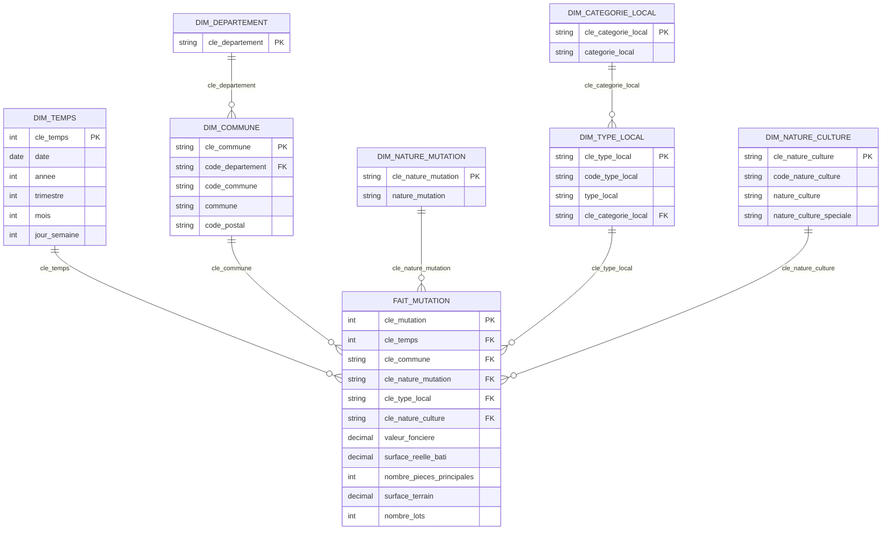

# Datamart DVF 2025 — modèle en flocon

Généré par `convert_dvf_to_datamart.py` à partir de `ValeursFoncieres-2025.txt`.

---

## 1. Schéma en flocon



**Deux branches de normalisation** — c'est ce qui en fait un *flocon* et non une *étoile* :

| Branche | Détail |
|---|---|
| `DIM_COMMUNE` → `DIM_DEPARTEMENT` | la commune est rattachée à son département |
| `DIM_TYPE_LOCAL` → `DIM_CATEGORIE_LOCAL` | le type de bien est rattaché à une catégorie (Habitation, Professionnel…) |

---

## 2. Fichiers produits (`datamart/`)

| Fichier | Lignes | Rôle |
|---|---:|---|
| `fait_mutation.csv` | 3 714 829 | table de faits (1 ligne = 1 bien dans 1 mutation) |
| `dim_temps.csv` | 361 | calendrier (année, trimestre, mois, jour de semaine) |
| `dim_commune.csv` | 32 679 | communes |
| `dim_departement.csv` | 97 | départements |
| `dim_nature_mutation.csv` | 6 | Vente, Échange, Adjudication, Expropriation… |
| `dim_type_local.csv` | 5 | Maison, Appartement, Immeuble, Local comm. |
| `dim_categorie_local.csv` | 5 | Habitation, Immeuble collectif, Professionnel… |
| `dim_nature_culture.csv` | 224 | nature de culture / terrain |

Format : séparateur `;`, décimale `,`, encodage `utf-8-sig`, dates ISO `AAAA-MM-JJ`.

> Les colonnes source `Identifiant de document` et `Reference document` sont
> **vides sur 100 %** des lignes : elles ne sont pas reprises dans le datamart.

---

## 3. ⚠️ Piège critique : la valeur foncière est répétée

Le fichier source **ne contient aucun identifiant de document**
(`Identifiant de document` et `Reference document` sont vides à 100 %).

Résultat : une mutation (vente) est éclatée en **plusieurs lignes** — une par bien —
et la `valeur_fonciere` est **répétée sur chacune**. En moyenne :

> 3 714 829 lignes ÷ 1 330 545 mutations = **2,79 lignes par mutation**

Conséquence sur les mesures :

| Calcul | Résultat | Verdict |
|---|---:|---|
| `SUM(valeur_fonciere)` sur toutes les lignes | 3 172 222 459 881 € | ❌ **~10× trop élevé** |
| `SUM(valeur_fonciere)` une fois par `cle_mutation` | 321 027 502 175 € | ✅ correct |

**La colonne `cle_mutation` a donc été ajoutée au fait** : elle regroupe les lignes
contiguës partageant `date + commune + nature + valeur`. C'est la seule façon
d'obtenir un nombre de ventes et un montant total justes.

### Mesures DAX correctes à utiliser

```dax
Nb mutations :=
DISTINCTCOUNT ( fait_mutation[cle_mutation] )

Valeur fonciere totale :=
SUMX (
    VALUES ( fait_mutation[cle_mutation] ),
    CALCULATE ( MAX ( fait_mutation[valeur_fonciere] ) )
)

Valeur fonciere moyenne par mutation :=
DIVIDE ( [Valeur fonciere totale], [Nb mutations] )

Prix moyen au m2 :=
DIVIDE (
    SUM ( fait_mutation[valeur_fonciere] ),
    SUM ( fait_mutation[surface_reelle_bati] )
)
```

---

## 4. Transformations réalisées (pour le rendu)

1. **Séparation d'une table en plusieurs** — le fichier plat (43 colonnes)
   devient 1 fait + 8 dimensions.
2. **Modification de clé** — reconstruction des codes INSEE / postaux dont les
   **zéros de tête avaient été perdus** dans le fichier source
   (`1400` → `01400`, `1` → `001`) et création de clés de substitution
   (`cle_mutation`, `cle_temps`, `cle_commune`, `cle_nature_culture`).
3. **Colonnes calculées** — `trimestre`, `annee`, `mois`, `jour_semaine`,
   `categorie_local`, libellés de `nature_culture`.
4. **Agrégation / regroupement** — reconstruction de la notion de mutation
   (`cle_mutation`) à partir de lignes éclatées.

> Le cahier des charges demande **au moins 3** de ces transformations : les 4 sont couvertes.

---

## 5. Import dans Power BI

Au total : **8 fichiers** (7 dimensions + 1 table de faits) et **7 relations**.

### Power BI Desktop (recommandé)

1. **Accueil → Obtenir les données → Texte/CSV**
2. Importer les 8 fichiers de `datamart/`, **chacun comme table séparée**
   (ne pas combiner)
   - Origine du fichier : `UTF-8`
   - Délimiteur : `Point-virgule`
   - Type de données détecté : cocher **« Détecter automatiquement »** puis corriger
     `valeur_fonciere`, `surface_reelle_bati`, `surface_terrain` en **Nombre décimal**
     et `cle_temps` en **Nombre entier**
3. **Vue Modèle** : créer les 7 relations (1 → \*), sens de filtre unique :

   | Depuis (1) | Vers (*) |
   |---|---|
   | `dim_temps[cle_temps]` | `fait_mutation[cle_temps]` |
   | `dim_commune[cle_commune]` | `fait_mutation[cle_commune]` |
   | `dim_nature_mutation[cle_nature_mutation]` | `fait_mutation[cle_nature_mutation]` |
   | `dim_type_local[cle_type_local]` | `fait_mutation[cle_type_local]` |
   | `dim_nature_culture[cle_nature_culture]` | `fait_mutation[cle_nature_culture]` |
   | `dim_departement[cle_departement]` | `dim_commune[code_departement]` |
   | `dim_categorie_local[cle_categorie_local]` | `dim_type_local[cle_categorie_local]` |

4. **Matrice** : lignes = `dim_temps[annee]` / `dim_commune[commune]`,
   colonnes = `dim_type_local[type_local]`, valeurs = `[Nb mutations]`, `[Valeur fonciere totale]`.

### Service web (app.powerbi.com)

Le web **propose bien Power Query** : `Get Data` → `Text/CSV` → `Upload file`.
Mais l'assistant traite **un seul fichier à la fois** et les fichiers partent dans
le **OneDrive for Business** (pas dans le rapport). Pour 8 fichiers c'est faisable
mais laborieux ; avec le fait de 235 Mo l'upload est très lent. Desktop reste
nettement plus pratique, puis **Publier**.

---

## 6. Reproduire la conversion

```powershell
# environnement
python -m venv .venv

# conversion complète (format français : ';' + ',')
.venv\Scripts\python.exe convert_dvf_to_datamart.py

# échantillon de 200 000 lignes (utile pour tester vite)
.venv\Scripts\python.exe convert_dvf_to_datamart.py --limit 200000

# format international (',' + '.')
.venv\Scripts\python.exe convert_dvf_to_datamart.py --us-format
```
