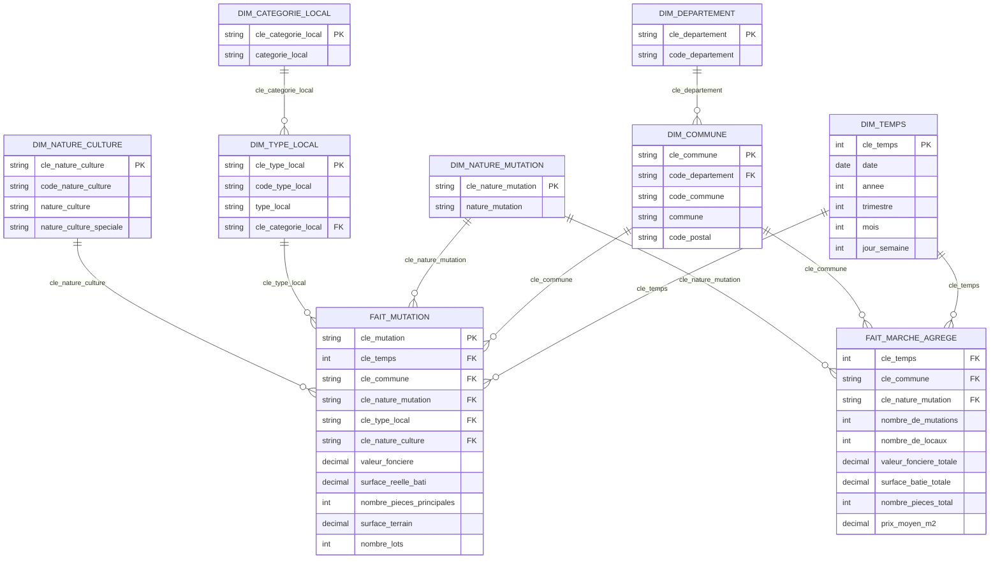

# Datamart DVF 2025 - modèle en flocon

Datamart construit **intégralement en Power Query** dans Power BI Desktop, à partir
du fichier source brut `ValeursFoncieres-2025.txt` (473 Mo, 43 colonnes, séparateur `|`).

> Le script `convert_dvf_to_datamart.py` a servi de brouillon pour valider le modèle
> (il produisait des CSV intermédiaires). Il n'est **plus utilisé** : toutes les
> transformations sont désormais dans Power Query.

---

## 1. Schéma en flocon



**10 relations**, toutes en 1 vers \*, filtre à sens unique.

---

## 2. Requêtes Power Query

Tout part d'**une seule requête partagée** qui lit le fichier source. Les autres
requêtes la référencent par son nom : le fichier n'est donc lu **qu'une fois par
actualisation**.

| Requête | Rôle | Lignes |
|---|---|---:|
| `DVF_Brut` | lit le `.txt` : 20 colonnes conservées sur 43, renommage, conversion des types (locale `fr-FR`), reconstruction des zéros de tête | 3 714 829 |
| `q_fait_mutation` | table de faits détaillée : construction des 5 clés étrangères + `cle_mutation` | 3 714 829 |
| `q_fait_agrege` | table de faits agrégée (datamart) | 820 774 |
| `q_dim_temps` | calendrier (année, trimestre, mois, jour de semaine) | 361 |
| `q_dim_commune` | communes | 32 679 |
| `q_dim_departement` | départements | 97 |
| `q_dim_nature_mutation` | Vente, Échange, Adjudication, Expropriation… | 6 |
| `q_dim_type_local` | Maison, Appartement, Immeuble, Local comm. | 4 |
| `q_dim_categorie_local` | catégories de local (table de référence écrite en M) | 5 |
| `q_dim_nature_culture` | nature de culture / terrain | 225 |

Ces requêtes alimentent les **9 tables** du modèle :

| Table | Requête source | Lignes |
|---|---|---:|
| `fait_mutation` (datawarehouse) | `q_fait_mutation` | 3 714 829 |
| `fait_marche_agrege` (datamart) | `q_fait_agrege` | 820 774 |
| `dim_temps` | `q_dim_temps` | 361 |
| `dim_commune` | `q_dim_commune` | 32 679 |
| `dim_departement` | `q_dim_departement` | 97 |
| `dim_nature_mutation` | `q_dim_nature_mutation` | 6 |
| `dim_type_local` | `q_dim_type_local` | 4 |
| `dim_categorie_local` | `q_dim_categorie_local` | 5 |
| `dim_nature_culture` | `q_dim_nature_culture` | 225 |

> Les colonnes source `Identifiant de document` et `Reference document` sont
> **vides sur 100 %** des lignes : elles ne sont pas chargées.
>
> Les CSV du dossier `datamart/` ne sont plus utilisés par Power BI. Ils restent
> comme trace du brouillon Python.

---

## 3. ⚠️ Piège critique : la valeur foncière est répétée

Le fichier source **ne contient aucun identifiant de document**
(`Identifiant de document` et `Reference document` sont vides à 100 %).

Résultat : une mutation (vente) est éclatée en **plusieurs lignes**, une par bien,
et la `valeur_fonciere` est **répétée sur chacune**. En moyenne :

> 3 714 829 lignes ÷ 1 320 973 mutations = **2,81 lignes par mutation**

Conséquence sur les mesures :

| Calcul | Résultat | Verdict |
|---|---:|---|
| `SUM(valeur_fonciere)` sur toutes les lignes | 3 172 222 459 880 € | ❌ **~10× trop élevé** |
| `SUM(valeur_fonciere)` une fois par `cle_mutation` | 319 901 489 835 € | ✅ correct |

C'est la raison d'être de la table de faits **agrégée** : elle stocke directement
la valeur correcte, une seule fois par mutation.

**La colonne `cle_mutation` regroupe les lignes contiguës** partageant
`date + commune + nature + valeur`. C'est la seule façon d'obtenir un nombre de
ventes et un montant total justes.

### Mesures DAX correctes à utiliser

```dax
Nb mutations :=
DISTINCTCOUNT ( fait_mutation[cle_mutation] )

Valeur fonciere totale :=
SUMX (
    VALUES ( fait_mutation[cle_mutation] ),
    CALCULATE ( AVERAGE ( fait_mutation[valeur_fonciere] ) )
)

Valeur fonciere moyenne par mutation :=
DIVIDE ( [Valeur fonciere totale], [Nb mutations] )

Prix moyen au m2 :=
DIVIDE (
    [Valeur fonciere totale],
    SUM ( fait_mutation[surface_reelle_bati] )
)
```

> `AVERAGE` (et non `MAX`) est utilisé dans le modèle : si la valeur est absente
> sur une des lignes d'une mutation, la moyenne la retrouve au lieu de renvoyer 0.

Les mesures déposées dans le modèle :

| Mesure | Table | Formule |
|---|---|---|
| `Nombre de mutations` | `fait_mutation` | `DISTINCTCOUNT(cle_mutation)` |
| `Valeur fonciere totale` | `fait_mutation` | `SUMX(VALUES(cle_mutation), CALCULATE(AVERAGE(valeur_fonciere)))` |
| `Valeur fonciere moyenne` | `fait_mutation` | `DIVIDE([Valeur fonciere totale], [Nombre de mutations])` |
| `Surface batie totale` | `fait_mutation` | `SUM(surface_reelle_bati)` |
| `Surface terrain totale` | `fait_mutation` | `SUM(surface_terrain)` |
| `Prix moyen m2` | `fait_mutation` | `DIVIDE([Valeur fonciere totale], [Surface batie totale])` |
| `Nombre de locaux` | `fait_mutation` | `COUNTROWS(fait_mutation)` |
| `Nb mutations agrege` | `fait_marche_agrege` | `SUM(nombre_de_mutations)` |
| `Nb locaux agrege` | `fait_marche_agrege` | `SUM(nombre_de_locaux)` |
| `Valeur agregee` | `fait_marche_agrege` | `SUM(valeur_fonciere_totale)` |
| `Valeur moyenne agregee` | `fait_marche_agrege` | `DIVIDE([Valeur agregee], [Nb mutations agrege])` |
| `Surface agregee` | `fait_marche_agrege` | `SUM(surface_batie_totale)` |
| `Prix moyen m2 agrege` | `fait_marche_agrege` | `DIVIDE([Valeur agregee], [Surface agregee])` |

Contrôle de cohérence entre les deux tables de faits :

| Indicateur | Table détaillée | Table agrégée |
|---|---:|---:|
| Nombre de mutations | 1 320 973 | 1 320 973 |
| Valeur foncière totale | 319 901 489 835 € | 319 901 489 835 € |
| Prix moyen au m² | 2 187,23 € | 2 187,23 € |

---

## 4. Transformations réalisées (pour le rendu)

Les 5 transformations du cahier des charges sont couvertes (**3 demandées**),
et **toutes sont faites dans Power Query**.

| # | Transformation | Où, dans Power Query |
|---|---|---|
| 1 | **Séparation d'une table en plusieurs** | `DVF_Brut` (43 colonnes) alimente 1 fait détaillée + 8 dimensions via `Table.SelectColumns` |
| 2 | **Colonnes calculées** | `cle_temps`, `annee`, `trimestre`, `mois`, `jour_semaine` (`q_dim_temps`) ; `cle_commune` (`q_dim_commune`) ; `cle_nature_culture` (`q_dim_nature_culture`) ; `cle_categorie_local` (`q_dim_type_local`) ; `cle_mutation` (`q_fait_mutation`) ; `prix_moyen_m2` (`q_fait_agrege`) |
| 3 | **Modification de clé** | reconstruction des codes INSEE et postaux dont les **zéros de tête avaient été perdus** dans le source (`1550` → `01550`, `158` → `00158`) via `Text.PadStart` ; création des clés de substitution `cle_temps`, `cle_commune`, `cle_nature_culture`, `cle_mutation`, `cle_departement`, `cle_type_local` |
| 4 | **Dédoublonnage** | `Table.Distinct` sur chaque dimension ; `Table.Distinct` sur la clé pour garantir l'unicité côté « 1 » (`cle_commune`, `cle_nature_culture`) ; `Table.Distinct` sur `cle_mutation` dans `q_fait_agrege` |
| 5 | **Agrégation** | `q_fait_agrege` : `Table.Group` par `cle_temps + cle_commune + cle_nature_mutation` pour calculer le nombre de mutations, la valeur totale, la surface bâtie et le prix moyen au m² |

---

## 5. Architecture : datawarehouse + datamart

Le cahier des charges impose **une table de faits détaillée et une table de faits
agrégée**. Le modèle en contient deux :

### `fait_mutation` : table de faits détaillée (datawarehouse)

- **Grain** : 1 ligne = 1 bien (local) dans 1 mutation.
- **Volume** : 3 714 829 lignes.
- **Clés étrangères** : `cle_temps`, `cle_commune`, `cle_nature_mutation`,
  `cle_type_local`, `cle_nature_culture` (5 dimensions).
- **Usage** : analyses fines, croisement par type de bien, pièces, surfaces.

### `fait_marche_agrege` : table de faits agrégée (datamart)

- **Grain** : 1 ligne = 1 commune × 1 jour × 1 nature de mutation.
- **Volume** : 820 774 lignes (4,5× plus compacte).
- **Clés étrangères** : `cle_temps`, `cle_commune`, `cle_nature_mutation`.
- **Mesures stockées** : `nombre_de_mutations`, `nombre_de_locaux`,
  `valeur_fonciere_totale`, `surface_batie_totale`, `nombre_pieces_total`,
  `prix_moyen_m2`.
- **Usage** : tableaux de bord synthétiques, historiques par territoire.

> Le grain de l'agrégat a été choisi sur des attributs **de la mutation**
> (`commune`, `date`, `nature`) et non du bien : c'est le seul grain qui permet
> de sommer la valeur foncière sans la compter plusieurs fois.

---

## 6. Cas métier et besoin analytique

### Cas métier

Suivre le **marché immobilier français** à partir des mutations foncières
enregistrées en 2025 (DVF, source `data.gouv.fr`) : où se vend quoi, à quel prix,
et comment le prix au m² évolue dans l'année.

### Besoin analytique

> Pour un territoire (commune / département) et une période (année, trimestre, mois),
> connaître le **nombre de mutations**, le **volume total** en euros et le
> **prix moyen au m²**, et pouvoir ventiler par **type de bien** et
> **nature de mutation**.

### Tableau croisé (matrice) à réaliser

| | Colonne |
|---|---|
| **Lignes** | `dim_commune[commune]` (ou `dim_departement[cle_departement]`) |
| **Colonnes** | `dim_temps[annee]` (ou `dim_temps[trimestre]`) |
| **Valeurs** | `[Nombre de mutations]`, `[Valeur fonciere totale]`, `[Prix moyen m2]` |
| **Filtres (segment)** | `dim_type_local[type_local]`, `dim_nature_mutation[nature_mutation]` |

Variante « datamart » (plus rapide) : lignes = `dim_commune[commune]`,
colonnes = `dim_temps[annee]`, valeurs = `[Nb mutations agrege]`, `[Valeur agregee]`,
`[Prix moyen m2 agrege]`.

Résultats de contrôle obtenus sur le modèle :

| Département | Mutations | Prix moyen au m² |
|---|---:|---:|
| Paris (75) | 40 362 | 10 713 € |
| Hauts-de-Seine (92) | 26 082 | 6 924 € |
| Alpes-Maritimes (06) | 33 829 | 4 630 € |
| Var (83) | 30 716 | 3 473 € |
| Bouches-du-Rhône (13) | 37 299 | 3 376 € |

---

## 7. Reproduire / actualiser

Le datamart n'est plus produit par un script : il est **construit par Power Query
dans le fichier `.pbix`**.

1. Ouvrir `solaris.pbix` dans Power BI Desktop.
2. **Accueil → Actualiser** : Power Query relit `ValeursFoncieres-2025.txt` et
   reconstruit les 9 tables.
3. Le fichier source doit rester à cet emplacement :
   `C:\Users\Lenovo\Desktop\PowerBi\Projet_Solaris\ValeursFoncieres-2025.txt`.
   Le chemin est codé dans la requête `DVF_Brut` (chemin absolu).

> Un rafraîchissement complet relit 473 Mo et reconstruit les agrégats :
> comptez plusieurs minutes.

### Ancien brouillon Python (conservé, non utilisé)

```powershell
python -m venv .venv
.venv\Scripts\python.exe convert_dvf_to_datamart.py
.venv\Scripts\python.exe convert_dvf_to_datamart.py --limit 200000
```
